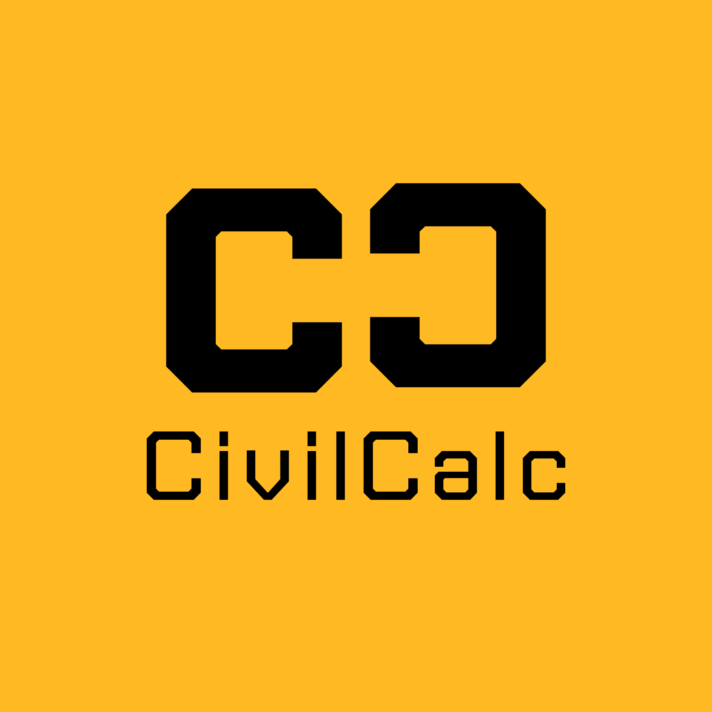

<p align="center">

 </p>
# CivilCalc

CivilCalc adalah aplikasi web sederhana untuk membantu mahasiswa Teknik Sipil melakukan perhitungan dasar konstruksi dengan cepat dan mudah.

## Fitur

* Menghitung luas bangunan
* Menghitung volume beton
* Mengestimasi kebutuhan semen
* Tampilan responsif dan mudah digunakan

## Teknologi yang Digunakan

* HTML5
* CSS3
* JavaScript

## Cara Menjalankan

1. Clone repository ini:

```bash
git clone https://github.com/fauzanabdullah/civilcalc.git
```

2. Masuk ke folder project:

```bash
cd civilcalc
```

3. Buka file `index.html` menggunakan browser (Google Chrome, Mozilla Firefox, Microsoft Edge, atau browser lainnya).

Alternatif lain, jika menggunakan Visual Studio Code, buka file `index.html` menggunakan ekstensi **Live Server**.

Aplikasi juga dapat diakses secara langsung melalui GitHub Pages:

```text
https://fauzanabdullah.github.io/civilcalc/
```

## Perhitungan

### Luas Bangunan

```text
Luas = Panjang × Lebar
```

### Volume Beton

```text
Volume = Panjang × Lebar × Tinggi
```

### Kebutuhan Semen

```text
1 m³ beton ≈ 8 sak semen
```

## Struktur Project

```text
civilcalc/
│
├── index.html
├── style.css
├── script.js
└── README.md
```

## Tujuan Pengembangan

Project ini dibuat sebagai media pembelajaran pemrograman web dan penerapannya dalam bidang Teknik Sipil.

## Pengembang

**Fauzan Abdullah**


## Lisensi

Project ini dibuat untuk keperluan pendidikan dan tugas akademik.
